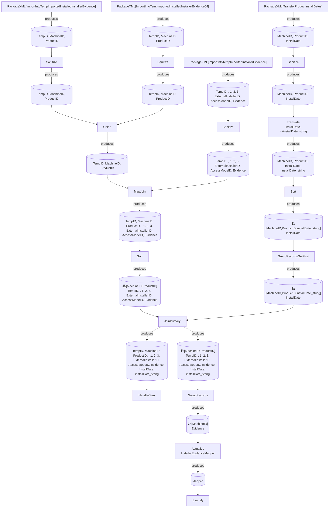

```mermaid
graph TD
    classDef box width:fit-content,height:fit-content;
    0["PackageXML[ImportIntoTempImportedInstallerEvidence]"]
    0 -- produces --> s1[("TempID, , 1, 2, 3, ExternalInstallerID, AccessModeID, Evidence")]:::box
    1["Sanitize"]
    1 -- produces --> s2[("TempID, , 1, 2, 3, ExternalInstallerID, AccessModeID, Evidence")]:::box
    s1 --> 1
    2["PackageXML[ImportIntoTempImportedInstalledInstallerEvidence]"]
    2 -- produces --> s3[("TempID, MachineID, ProductID")]:::box
    3["Sanitize"]
    3 -- produces --> s4[("TempID, MachineID, ProductID")]:::box
    s3 --> 3
    4["PackageXML[ImportIntoTempImportedInstalledInstallerEvidence64]"]
    4 -- produces --> s5[("TempID, MachineID, ProductID")]:::box
    5["Sanitize"]
    5 -- produces --> s6[("TempID, MachineID, ProductID")]:::box
    s5 --> 5
    6["PackageXML[TransferProductInstallDates]"]
    6 -- produces --> s7[("MachineID, ProductID, InstallDate")]:::box
    7["Sanitize"]
    7 -- produces --> s8[("MachineID, ProductID, InstallDate")]:::box
    s7 --> 7
    8["Union"]
    8 -- produces --> s9[("TempID, MachineID, ProductID")]:::box
    s4 --> 8
    s6 --> 8
    9["MapJoin"]
    9 -- produces --> s10[("TempID, MachineID, ProductID, , 1, 2, 3, ExternalInstallerID, AccessModeID, Evidence")]:::box
    s9 --> 9
    s2 --> 9
    10["Sort"]
    10 -- produces --> s11[("fa:fa-arrow-down-short-wide[MachineID,ProductID]
TempID, , 1, 2, 3, ExternalInstallerID, AccessModeID, Evidence")]:::box
    s10 --> 10
    11["Translate
InstallDate->+installDate_string"]
    11 -- produces --> s12[("MachineID, ProductID, InstallDate, installDate_string")]:::box
    s8 --> 11
    12["Sort"]
    12 -- produces --> s13[("fa:fa-arrow-down-short-wide[MachineID,ProductID,installDate_string]
InstallDate")]:::box
    s12 --> 12
    13["GroupRecordsGetFirst"]
    13 -- produces --> s14[("fa:fa-arrow-down-short-wide[MachineID,ProductID,installDate_string]
InstallDate")]:::box
    s13 --> 13
    14["JoinPrimary"]
    14 -- produces --> s15[("fa:fa-arrow-down-short-wide[MachineID,ProductID]
TempID, , 1, 2, 3, ExternalInstallerID, AccessModeID, Evidence, InstallDate, installDate_string")]:::box
    14 -- produces --> s16[("TempID, MachineID, ProductID, , 1, 2, 3, ExternalInstallerID, AccessModeID, Evidence, InstallDate, installDate_string")]:::box
    s11 --> 14
    s14 --> 14
    15["HandlerSink"]
    s16 --> 15
    16["GroupRecords"]
    16 -- produces --> s17[("fa:fa-arrow-down-short-wide[MachineID]
Evidence")]:::box
    s15 --> 16
    17["Actualize
InstallerEvidenceMapper"]
    17 -- produces --> s18[("Mapped")]:::box
    s17 --> 17
    18["Eventify"]
    s18 --> 18
```
